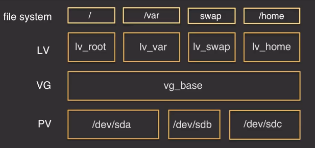

- [AWS Linux](#aws-linux)
  * [Instalamos Servidor en AWS](#instalamos-servidor-en-aws)
  * [Configurar Hostname](#configurar-hostname)
  * [Configurar fichero /etc/hosts](#configurar-fichero-etc-hosts)
  * [SELINUX](#selinux)
  * [Configurar Timezone & NTP](#configurar-timezone-y-ntp)
  * [Servicios](#servicios)
  * [Parámetros de kernel](#parámetros-de-kernel)
  * [Usuarios y Grupos](#usuarios-y-grupos)
  * [Límites](#límites)
  * [Gestión de Paquetes](#gestión-de-paquetes)
  * [Filesystems](#filesystems)
  * [Ampliar Filesystems](#ampliar-filesystems)
  * [Swap](#swap)
  * [Configurar las Xs](#configurar-las-xs)

# AWS Linux

## Instalamos Servidor en AWS
* Region: US East (N. Virginia) -> us-east-1
* VPC: formacion - CIDR Block: 10.10.0.0/16
* Subnet: formacion - CIDR Block: 10.10.0.0/16
* Internet gateway: formacion -> atachada a la VPC
* Public subnet route table: formacion
<pre>
0.0.0.0/0 igw
</pre>
* Security Group: formacion -> atachada a la VPC
<pre>
Inboud rules:
Type: SSH
Procotol: TCP
Port Range: 22
Source: 0.0.0.0/0
</pre>
* Instancias EC2:    
  * formacion_rhel8 -> RHEL-8.2.0_HVM-20200423-x86_64-0-Hourly2-GP2 (ami-098f16afa9edf40be)
    * t2.micro
 
  * formacion_sles15 -> suse-sles-15-sp1-v20200226-hvm-ssd-x86_64 (ami-0068cd63259e9f24c)
    * t2.micro
* Conexión:
<pre>
+formacion_rhel8
ssh -i /home/renzo/aws_linux/aws_keys/formacion.pem ec2-user@ec2_rhel8

+formacion_sles15
ssh -i /home/renzo/aws_linux/aws_keys/formacion.pem ec2-user@ec2_sles15
</pre>

## Configurar Hostname
* Hostname:
<pre>
hostnamectl

hostnamectl set-hostname ec2_rhel8
ls -l /etc/hostname

hostnamectl set-hostname ec2_sles15
ls -l /etc/HOSTNAME
</pre>

## Configurar fichero etc hosts
<pre>
ip a s

cp -p /etc/hosts /etc/hosts.`date +%Y%m%d`

diff /etc/hosts /etc/hosts.`date +%Y%m%d`
10.10.130.90 ec2_rhel8.pepe.com ec2_rhel8

cp -p /etc/hosts /etc/hosts.`date +%Y%m%d`

diff /etc/hosts /etc/hosts.`date +%Y%m%d`
10.10.14.176	ec2_sles15.pepe.com ec2_sles15

hostname
hostname -f
</pre>

## SELINUX
* Saber estado:
<pre>
sestatus

+En el ami de SLES15 por defecto el selinux esta deshabilitado.
</pre>

* Deshabilitar SELINUX
<pre>
+En caliente: setenforce 0
++permissive - SELinux prints warnings instead of enforcing.

+Persistente: /etc/selinux/config
cp -p /etc/selinux/config /etc/selinux/config.`date +%Y%m%d`
sed 's/^SELINUX=.*$/SELINUX=disabled/g' /etc/selinux/config
sed -i 's/^SELINUX=.*$/SELINUX=disabled/g' /etc/selinux/config
diff /etc/selinux/config /etc/selinux/config.`date +%Y%m%d`
++disabled - No SELinux policy is loaded.
</pre>

## Configurar Timezone y NTP
* Info:
 * https://docs.aws.amazon.com/es_es/AWSEC2/latest/UserGuide/set-time.html

* Timezone:
<pre>
ls -lrt /usr/share/zoneinfo/Europe/Madrid
ls -l /etc/localtime
date

ln -sf /usr/share/zoneinfo/Europe/Madrid /etc/localtime
date

+++ln -sf /usr/share/zoneinfo/America/Los_Angeles /etc/localtime
</pre>

* NTP:
<pre>
http://support.ntp.org/bin/view/Servers/WebHome
http://support.ntp.org/bin/view/Servers/NTPPoolServers
rpm -qa | grep chrony

+NTP status:
chronyc sources -v
cat /etc/chrony.conf  | egrep -v "^#|^$"
cp -p /etc/chrony.conf /etc/chrony.conf.`date +%Y%m%d`

systemctl restart chronyd
systemctl is-enabled chronyd
</pre>

## Servicios
* Listar todos los servicios:
<pre>
systemctl list-unit-files

systemctl -la
</pre>

* Estado de servicios:
<pre>
systemctl status chronyd
</pre>

* Parar/Reiniciar/Iniciar:
<pre>
systemctl stop chronyd
systemctl start chronyd
systemctl restart chronyd
</pre>

* Validar si está configurado en el arranque del sistema, habilitar/deshabilitar:
<pre>
systemctl is-enabled chronyd
systemctl disable chronyd
systemctl enable chronyd
</pre>

## Parámetros de kernel
* Configurar parámetros de kernel
<pre>
cp -p /etc/sysctl.conf /etc/sysctl.conf.`date +%Y%m%d`

sysctl -p
sysctl -a

-------------------------------------------------------------------------------------------------------------------------
+RHEL (SAP ASE)
net.core.rmem_max = 16777216
net.core.wmem_max = 16777216
net.core.rmem_default = 16777216
net.core.wmem_default = 16777216
net.core.optmem_max = 16777216
net.core.netdev_max_backlog = 300000
net.ipv4.tcp_rmem = 65536 16777216 16777216
net.ipv4.tcp_wmem = 65536 16777216 16777216
net.ipv4.tcp_no_metrics_save = 1
net.ipv4.tcp_moderate_rcvbuf = 1
net.ipv4.tcp_window_scaling = 1
net.ipv4.tcp_timestamps = 1
net.ipv4.tcp_sack = 1
kernel.sysrq = 0
net.ipv4.tcp_syncookies = 1

sysctl -a | egrep -w "net.core.rmem_max|net.core.wmem_max|net.core.rmem_default|net.core.wmem_default|net.core.optmem_max|net.core.netdev_max_backlog|net.ipv4.tcp_rmem|net.ipv4.tcp_wmem|net.ipv4.tcp_no_metrics_save|net.ipv4.tcp_moderate_rcvbuf|net.ipv4.tcp_window_scaling|net.ipv4.tcp_timestamps|net.ipv4.tcp_sack|kernel.sysrq|net.ipv4.tcp_syncookies"

-------------------------------------------------------------------------------------------------------------------------
+SLES
vm.dirty_ratio = 2
vm.dirty_background_ratio = 1
net.core.somaxconn = 4096
net.ipv4.tcp_max_syn_backlog = 8192
net.ipv4.tcp_tw_reuse = 1
net.ipv4.tcp_syn_retries = 8

sysctl -a | egrep -w "vm.dirty_ratio|vm.dirty_background_ratio|net.core.somaxconn|net.ipv4.tcp_max_syn_backlog|net.ipv4.tcp_tw_reuse|net.ipv4.tcp_syn_retries"

-------------------------------------------------------------------------------------------------------------------------
</pre>

## Usuarios y Grupos
<pre>
groupadd -g XXXX sapsys

useradd -m -d /home/saptest -g sapsys -u XXX saptest
</pre>

## Límites
* https://www.thegeekdiary.com/understanding-etc-security-limits-conf-file-to-set-ulimit/
<pre>
 su - saptest
 ulimit -a
 ulimit -a | grep "open files"
 
/etc/security/limits.conf

vi /etc/security/limits.d/sap.conf
@sapsys soft nofile 65536
@sapsys hard nofile 65536

#SAP ASE
@sapsys soft nofile 65536
@sapsys hard nofile 65536
@sdba soft nofile 65536
@sdba hard nofile 65536
@dba soft nofile 65536
@dba hard nofile 65536

su - saptest
ulimit -a                   #validar limites aplicados
ulimit -a | grep "open files"
</pre>

## Gestión de Paquetes
* Paquetes básicos o recomendados a instalar en una instalación de Linux (telnet, unzip…)
<pre>
-------------------------------------------------------------------------------------------------------------
+RHEL:
yum clean all                            dnf clean all
yum repolist                             dnf repolist
cd /etc/yum.reposd                       # <--- ubicacion de repositorios configurados en el servidor
yum list                                 dnf list
yum list --installed                     dnf list --installed
yum search                               dnf search 
yum provides '*/ls'                      dnf provides */ls
yum info                                 dnf info vim

yum install telnet unzip zip wget        dnf install telnet unzip zip wget 
yum install xorg-x11-xauth               dnf install xorg-x11-xauth 

yum remove XXXX                          dnf remove XXXX

-------------------------------------------------------------------------------------------------------------
+SLES:
zypper install telnet unzip zip wget
zypper install xorg-x11-xauth

zypper ls
zypper packages 
zypper packages --installed-only
zypper se
zypper search --provides '*/ls'

-------------------------------------------------------------------------------------------------------------
+RPM:
rpm -qa                                   #listar todos los paquetes instalados
rpm -qi                                   #obtener información de un paquete
rpm -ql bash-4.4.19-10.el8.x86_64         #mostar los ficheros que contiene un paquete
rpm -qf /usr/share/man/man1/times.1.gz    #a partir de un fichero obtener el paquete de donde proviene

-------------------------------------------------------------------------------------------------------------
</pre>

## Filesystems
* Configurar filesystem
  * Los Instance Store Volumes no pueden ser detenidos, si el sistema falla los datos se pierden.

* Mirar Availability Zone del EC2

* Elastic Block Store
  * volumes
  * lsblk -f
  * fdisk -l | grep ^Disk | grep dev
  * /dev/sdb   #aparece como /dev/xvdb
  * fdisk -l | grep ^Disk | grep dev
  * lsblk -f
  
* yum install lvm2 (+En el AMI de sles15 ya viene por defecto instalado)

  * Excepto /boot que no ha de estar en LVM. 
  * Flexibilidad ampliar y reducir fs.

* Creamos una partición:
  * https://access.redhat.com/documentation/en-us/red_hat_enterprise_linux/7/html/logical_volume_manager_administration/physvol_admin
  * https://www.tldp.org/HOWTO/LVM-HOWTO/initdisks.html
<pre>
+ver tabla de particiones actualmente del disco:
fdisk -l /dev/xvdb

+Crear partición (unidad lógica):
fdisk /dev/xvdb
p     #muestra tabla de particiones
n     #nueva particion
p     #tipo de partición -> primaria
enter #default 1
enter #default primer sector
enter #default último sector
p     #muestra tabla de particiones
t     #tag del tipo de particion
8e    #Linux LVM
p     #muestra tabla de particion
w     #escribe estos datos al disco

ls -l /dev/xvdb1
</pre>

* Creamos pv (Physical Volume):  
<pre>
pvs                   #listamos los physical volumes que tenemos en el sistema
pvcreate /dev/xvdb1   #convertimos la partición a physical volume
pvs                   #listamos los physical volumes que tenemos en el sistema
</pre>

* Creamos vg (Volume Group):
  * Datos SO: vg00
  * Datos Cliente: vg_data
<pre>
+Necesitamos que exista el pv -> /dev/xvdb1

vgs
vgcreate vg_data /dev/xvdb1
vgs
</pre>

* Creamos lv (Logical Volume)
<pre>
lvs
lvcreate -n lv_test -L 3G vg_data
lvs
</pre>

* Damos formato al lv: 
  * http://www.veprof.com/linux-file-systems-and-their-differences.html
<pre>
mkfs.ext4 mkfs.ext4 /dev/vg_data/lv_test    #mkfs. tab or mkfs -t ext4
</pre>

* Configuramos el fs a nivel de SO y para que monte autmoaticamente en el inicio del sistema:
<pre>
cp -p /etc/fstab /etc/fstab.`date +%Y%m%d`
#grep test /etc/fstab
/dev/vg_data/lv_test			  /test		          ext4    defaults        1 2
mkdir /test
mount /test
df -Ph /test
</pre>

## Ampliar Filesystems
* Añadimos disco.
* Creamos partición.
* Creamos pv.
* Extendemos vg:
<pre>
vgs
vgextend vg_data /dev/xvdc1
vgs
</pre>
* Ampliamos lv y fs:
<pre>
df -Ph /test
lvextend -L +1G -r /dev/vg_data/lv_test 
df -Ph /test

lvextend -l +100%free -r /dev/vg_data/lv_test 
</pre>

## Swap
* Tamaño:
<pre>
SWAP
Configurar swap según recomendaciones de SO:
                - RHEL: https://access.redhat.com/documentation/en-us/red_hat_enterprise_linux/7/html/storage_administration_guide/ch-swapspace
                - Ubuntu: https://help.ubuntu.com/community/SwapFaq?_ga=2.73427474.1003327733.1559477591-305631208.1559477591#How_much_swap_do_I_need.3F

AWS:
    - https://aws.amazon.com/es/premiumsupport/knowledge-center/ec2-memory-partition-hard-drive/

#####SWAP
#2GB or less  Twice the installed RAM
#> 2GB - 8GB  The same amount of RAM
#> 8GB - 64GB At least 4GB
#> 64GB or more At least 4GB
</pre>

* Configurar swap
<pre>
+Creamos lv swap.
+Damos formato de swap al lv:
mkswap /dev/vg_data/lv_swap

+Añadimos entrada en /etc/fstab
cp -p /etc/fstab /etc/fstab.`date +%Y%m%d`
/dev/vg_data/lv_swap                    swap                    swap      defaults        0 0

+Montamos la swap
swapon -a

+validamos
free -m
</pre>

## Configurar las Xs
* Paquete a isntalar:
<pre>
+RHEL:
yum install xorg-x11-xauth
cd /tmp
#Siempre instalar de repositorios oficiales, este es esolo un ejemplo y no debe instalarse sw fuera de los repos oficiales:
wget https://rpmfind.net/linux/centos/8.1.1911/PowerTools/x86_64/os/Packages/xorg-x11-apps-7.7-21.el8.x86_64.rpm
yum install xorg-x11-apps-7.7-21.el8.x86_64.rpm 

+SLES:
zypper install xorg-x11-xauth
cd /tmp
#Siempre instalar de repositorios oficiales, este es esolo un ejemplo y no debe instalarse sw fuera de los repos oficiales:
wget https://download.opensuse.org/repositories/openSUSE:/Leap:/15.1/standard/x86_64/xclock-1.0.7-lp151.2.3.x86_64.rpm
zypper install xclock-1.0.7-lp151.2.3.x86_64.rpm
ignore key
</pre>

* Tener el x11 forwarding habiltado:
<pre>
cat /etc/ssh/sshd_config| grep -i ^X11Forwarding
X11Forwarding yes

cd
scp -i /home/renzo/aws_linux/aws_keys/formacion.pem .Xauthority ec2-user@ec2_rhel8:
scp -i /home/renzo/aws_linux/aws_keys/formacion.pem .Xauthority ec2-user@ec2_sles15:

Abro SW de Xs
ssh -X renzo@ansible
ssh -X -i /home/renzo/aws_linux/aws_keys/formacion.pem ec2-user@ec2_rhel8 
ssh -X -i /home/renzo/aws_linux/aws_keys/formacion.pem ec2-user@ec2_sles15
</pre>
